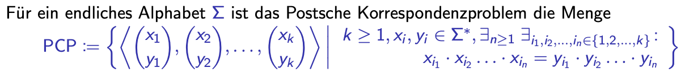

# PCP_Solver
This script is designed to solve the PCP-problem as efficient as possible. The PCP Problem is a semi-decidable problem. The Input is a list of tuples/pairs of a finite alphabet and the output can be either one of the shortest possible sequenzes or an infinite list of all possible sequenzes.
# PCP_Problem
