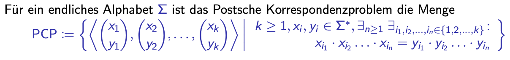

# PCP Solver

A high-performance Python-based solver for the **Post Correspondence Problem (PCP)**. This solver employs **Breadth-First Search (BFS)** combined with **state deduplication and pruning** to efficiently find the shortest solution sequence for any solvable instance, or report when no solution exists.

---

## Table of Contents
- [What is the PCP?](#what-is-the-pcp)
- [How the Solver Works](#how-the-solver-works)
  - [1. Starting Condition Filtering](#1-starting-condition-filtering)
  - [2. State Representation](#2-state-representation)
  - [3. BFS Search Queue](#3-bfs-search-queue)
  - [4. State Deduplication & Pruning](#4-state-deduplication--pruning)
- [Project Structure](#project-structure)
- [Getting Started](#getting-started)
- [Usage Example & Walkthrough](#usage-example--walkthrough)
- [License](#license)

---

## What is the PCP?

The **Post Correspondence Problem (PCP)** is a classic undecidable decision problem in computability theory, introduced by Emil Post in 1946. 

Given a finite set of pairs of strings (tuples):

$$\{ (x_1, y_1), (x_2, y_2), \dots, (x_n, y_n) \}$$

The objective is to find a sequence of indices $i_1, i_2, \dots, i_k$ (where $1 \le i_j \le n$) such that the concatenation of the first elements matches the concatenation of the second elements:

$$x_{i_1} x_{i_2} \cdots x_{i_k} = y_{i_1} y_{i_2} \cdots y_{i_k}$$



---

## How the Solver Works

Solving PCP is semi-decidable, meaning we can find a solution if one exists, but the search space can grow exponentially or infinitely. To tackle this, the solver implements several key optimizations:

### 1. Starting Condition Filtering
A sequence can only start with a tuple $(x_i, y_i)$ where one string is a prefix of the other (e.g., $x_i$ is a prefix of $y_i$, or vice-versa). The solver filters out any tuples that don't satisfy this criteria during initialization (`init_organizer`), drastically reducing the branching factor right at the start.

### 2. State Representation
Rather than storing the full concatenated strings (which grow longer and longer), each [Sequence](file:///Users/amonbeatnewe/Desktop/Uni/3.Semester/PCP_Solver/Sequence.py) object only tracks:
* `missing`: The mismatched suffix string that remains to be matched.
* `more_in_first`: A boolean flag indicating which of the two string lists is currently longer (`True` if the top list is longer, `False` if the bottom list is longer).
* `pcp_queue`: The sequence of tuple IDs used to reach this state.

### 3. BFS Search Queue
By using a Breadth-First Search (BFS) queue, the solver explores sequences in order of their length. This guarantees that the first solution discovered is the **shortest possible solution**.

### 4. State Deduplication & Pruning
If two different paths lead to the exact same remaining mismatch (i.e. identical `missing` and `more_in_first` values), any future additions will behave identically for both. 
The [Organizer](file:///Users/amonbeatnewe/Desktop/Uni/3.Semester/PCP_Solver/Organizer.py) maintains a `missing_tuples` set representing all visited states. If a new sequence generates a state that is already in the set, it is immediately discarded (pruned). This prevents infinite loops on cyclic states and keeps memory and CPU usage to a minimum.

---

## Project Structure

* [pcp_solver.py](file:///Users/amonbeatnewe/Desktop/Uni/3.Semester/PCP_Solver/pcp_solver.py): Main entry point. Handles console I/O, runs the BFS search loop, and displays the final solution.
* [Organizer.py](file:///Users/amonbeatnewe/Desktop/Uni/3.Semester/PCP_Solver/Organizer.py): Manages the search queue and handles state deduplication.
* [Sequence.py](file:///Users/amonbeatnewe/Desktop/Uni/3.Semester/PCP_Solver/Sequence.py): Represents a search path, keeping track of the selected tuples and calculating the mismatch suffix (`missing`).
* [PcpTuple.py](file:///Users/amonbeatnewe/Desktop/Uni/3.Semester/PCP_Solver/PcpTuple.py): Simple wrapper data class representing a PCP tuple pair $(x_i, y_i)$ and its index ID.

---

## Getting Started

### Prerequisites
* Python 3.10 or newer.

### Running the Solver
Run the main script using python:
```bash
python3 pcp_solver.py
```

---

## Usage Example & Walkthrough

Consider the following input system:
1. Tuple 1: `(a, aa)`
2. Tuple 2: `(aab, b)`

### Running the program:
```text
To add a tuple please write a blank space between the elements then press Enter.  When you are done simply enter # once.
Please enter the 1. tuple: a aa
Tuple:('a', 'aa')
Please enter the 2. tuple: aab b
Tuple:('aab', 'b')
Please enter the 3. tuple: #
All tuples are entered, calculating...
There are 1 possible tuples to begin with...
Solution Sequence: 1,1,2,
```

### Trace:
* **Start**: Only Tuple 1 can start since `a` is a prefix of `aa`.
  * Top: `a`
  * Bottom: `aa`
  * State: `more_in_first = False`, `missing = 'a'`
* **Step 1**: Try appending all tuples to the sequence:
  * Append Tuple 1 `(a, aa)`:
    * Top mismatch is matched with `a`. Bottom appends `aa`.
    * Top: `a` + `a` = `aa`
    * Bottom: `aa` + `aa` = `aaaa`
    * State: `more_in_first = False`, `missing = 'aa'`
* **Step 2**: Try appending to state from Step 1:
  * Append Tuple 2 `(aab, b)`:
    * Top mismatch is matched with `aab`. Bottom appends `b`.
    * Top: `aa` + `aab` = `aaaab`
    * Bottom: `aaaa` + `b` = `aaaab`
    * State: `missing = ''` (Strings are equal!)
* **Result**: A match is found! The indices are `1, 1, 2`.

---

## License

This project is licensed under the MIT License - see the [LICENSE](file:///Users/amonbeatnewe/Desktop/Uni/3.Semester/PCP_Solver/LICENSE) file for details.
